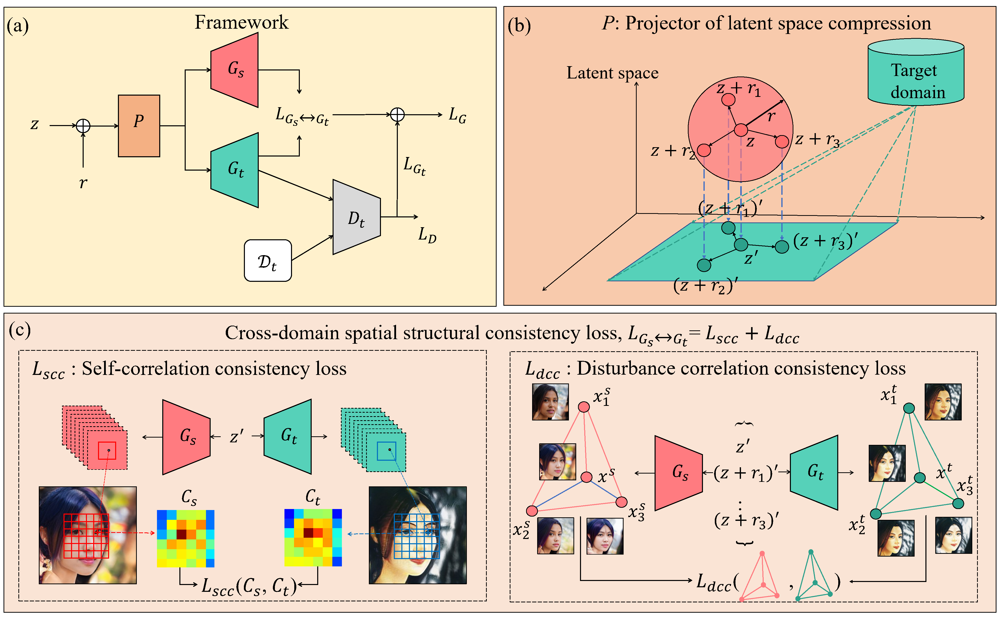

# Few Shot Generative Model Adaption via Relaxed Spatial Structural Alignment

## Overview


Our RSSA method help align the spatial structural information between source and target GAN to assist adaption.

## Requirements

**Note:** The base code of the training pipeline is taken from [few-shot-gan-adaption](https://github.com/utkarshojha/few-shot-gan-adaptation)'s implementation from [@Utkarsh Ojha](https://utkarshojha.github.io/)

- Linux
- NVIDIA GPU + CUDA CuDNN 11.1
- PyTorch 1.9.1
- Python 3.9.1
- Install all the libraries through `pip install -r requirements.txt` 

## Generating & Testing
We provide the pre-trained models for different source and target GAN models. Download the model from [Here!](https://drive.google.com/drive/folders/1v3Ge9uGqY294vFqcwqQIgznxgtrej6bm?usp=sharing) Store the source model into the `./checkpoints_ori` directory and the target model into the `./checkpoints` directory.

### Generate images
To generate images from a pre-trained source GAN and target GAN, run the following command:
```bash
CUDA_VISIBLE_DEVICES=0 python generate.py --ckpt_source /path/to/source_model/ --ckpt_target /path/to/target_model/ --task 10(5) --source source_domain --target target_domain --latent_dir /path/to/latent/ --mode viz_imgs
```

This will save synthesis samples into `./viz_img` directory. Use the `--load_noise` option to use the noise vectors used for some samples shown in the main paper. For example:
```bash
CUDA_VISIBLE_DEVICES=0 python generate.py --ckpt_source ./checkpoints_ori/face.pt --ckpt_target ./checkpoints/face2sketches_self_dis_proj_10/final.pt --task 10 --source face --target sketches --latent_dir latent/sketches/latent/ --mode viz_imgs --load_noise noise.pt
```

### Generate interpolation images
To generate interpolation images from source and target GAN, run the following command:
```bash
CUDA_VISIBLE_DEVICES=0 python generate.py --ckpt_source /path/to/source_model --ckpt_target /path/to/target_model/ --task 10(5) --source source_domain --target target_domain --latent_dir /path/to/latent/ --mode viz_gif --load_noise /path/to/noise_vector/
```

This will save synthesis interpolation images (for source and target) into `./viz_gif` directory. For example:
```bash
CUDA_VISIBLE_DEVICES=0 python generate.py --ckpt_source ./checkpoints_ori/face.pt --ckpt_target ./checkpoints/face2VanGogh_self_dis_proj_10/final.pt --task 10 --source face --target VanGogh --latent_dir latent/VanGogh_face/latent/ --mode viz_gif
```

### Evaluating Inception Score
First use the trained target model to synthesis images via the following command:
```bash
CUDA_VISIBLE_DEVICES=0 python generate.py --ckpt_target /path/to/target_model/ --task 10(5) --source source_domain --target target_domain --latent_dir /path/to/latent/ --mode eval_IS
```
This will synthesis 1000 samples for target domain by default and save them into the `./eval_IS` directory. For example:
```bash
CUDA_VISIBLE_DEVICES=0 python generate.py --ckpt_target ./checkpoints/face2VanGogh_self_dis_proj_10/final.pt --task 10 --source face --target VanGogh --latent_dir latent/VanGogh_face/latent/ --mode eval_IS
```
Then run `eval.py` to calculate the mean Inception Score for the synthesis images as below. Note to verify the save directory of the images synthesis by the above command.
```bash
CUDA_VISIBLE_DEVICES=0 python eval.py --mode IS --img_pth /path/to/eval4IS/images
```
For example:
```bash
CUDA_VISIBLE_DEVICES=0 python eval.py --mode IS --img_pth ./eval_IS/face2VanGogh_10
```

### Evaluating SCS Score
First generate cross-domain image pairs via the following command:
```bash
CUDA_VISIBLE_DEVICES=0 python generate.py --ckpt_source /path/to/source_model/ --ckpt_target /path/to/target_model/ --task 10(5) --source source_domain --target sketches --latent_dir /path/to/latent/ --mode eval_SCS --SCS_samples n
```
This will save synthesis cross-domain pairs in `./eval_SCS/` (500 pairs by default), verify the task directory (`./eval_SCS/church2VanGogh_10` for example) and run `eval.py` with following command to get the edges for the synthesis pairs and calculate the mean pair-wise SCS:
```bash
CUDA_VISIBLE_DEVICES=0 python eval.py --mode SCS --img_pth /path/to/synthesis/pairs/
```
For example:
```bash
CUDA_VISIBLE_DEVICES=0 python eval.py --mode SCS --img_pth eval_SCS/church2VanGogh_10
```


## Training (adapting) your own GAN
### Data preparation
The raw images are saved in the `./data/` directory, and the processed images are saved in the `./processed_data/` directory. If you want to train model on your own data, save them in `./data/` and run `prepare_data.py` to preprocess your raw data as follow:

- `python prepare_data.py --out processed_data/<dataset_name> --size 256 ./data/<dataset_name>`

### GAN inversion
First invert the training images using `invert_gan.py`, we also provide inverted latent code in the `./latent/` directory. The image2stylegan code base in this repo does not guarantee good reconstruction performance (shown in the `latent/target_domain/images`), you can use your own inversion method if you get better results. For example:

```bash
CUDA_VISIBLE_DEVICES=0 python invert_gan.py --image_dir data/caricatures/images/ --stylegan2_path checkpoints_ori/face.pt --latent_dir latent/caricatures/
```

### Training
Train your own GAN via commanding as follow. 
```bash
CUDA_VISIBLE_DEVICES=0 python train_face_proj.py --ckpt /path/to/source/model/ --data_path /path/to/processed/data/ --exp source2target --iter 2002 --self_corr_loss --proj --dis_corr_loss --latent_dir /path/to/latent/ --task 10(5) --exp_name target_domain --n_train 10
```
For example:
```bash
CUDA_VISIBLE_DEVICES=0 python train_face_proj.py --ckpt /checkpoints_ori/face.pt --data_path ./processed_data/sketches_5/  --exp face2sketches --iter 2002 --self_corr_loss --proj --dis_corr_loss --latent_dir latent/sketches/latent/ --task 5 --exp_name sketches
```
This will save the intermediate checkpoint in the `./checkpoints/face2sketches_self_dis_proj_5` directory and the intermediate samples in the `./samples/face2sketches_self_dis_proj_5` directory.

**Note**  that the spatial alignment is GPU memory consuming, runnig the above code with default configurations will cost 24 GB GPU memory. We run all of our experiments on one NVIDIA RTX 3090 GPU. Modifying the scale of self corr loss and dis corr loss may help reduce the spatial complexity.
